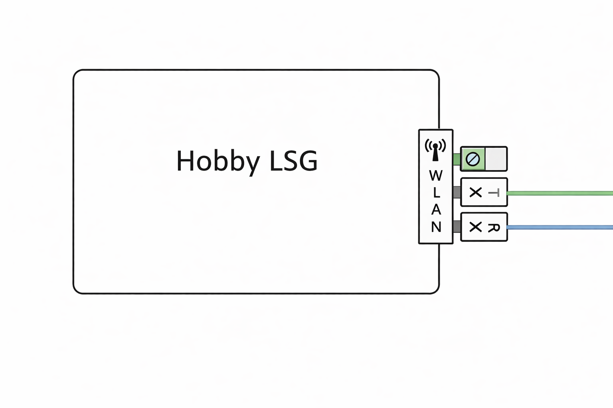

# Hobby Caravan CI-Bus Connectivity

Dieses Python-Skript initialisiert den Hobby CI-Bus über einen USB-zu-Serial Adapter und aktiviert den Datenstream.  
Es dient als Grundlage, um Fahrzeugdaten auszulesen und Geräte wie Licht, Heizung oder Klima über Systeme wie **Loxone** oder **Home Assistant** zu steuern.

---

## Funktionen

- Initialisierung des CI-Bus beim Systemstart  
- Aktivierung des Datenstreams (`!son`)  
- Abruf aller verfügbaren Variablen (`!gvl`)  
- Bereitstellung der Live-Daten über `/dev/ttyUSB0`  
- Vorbereitung für Integration in Loxone / Home Assistant  

---

## Anforderungen

- Raspberry Pi (z. B. 3B, 4, etc.)  
- USB-zu-Serial RS485 Adapter  
  → meist bereits vorhanden bei **Hobby Connect**

### Alternativ

- Kabel beim Hobby Händler  
- oder selbst bauen oder Löten (RS485 → LSG WLAN Schnittstelle)

### Optional

- Loxone Miniserver + Loxberry
- Home Assistant  

---

## Hardware Setup

Du benötigst:

- Raspberry Pi  
- RS485 Adapter (USB)  
- Verbindung zum LSG Modul  

### Anschlussmöglichkeiten

**Hobby Connect vorhanden**  
→ Adapter ist bereits verbaut  

**Ohne Hobby Connect**  
→ RS485 Kabel an WLAN/Service-Port des LSG anschließen  

---

## Installation

### Script kopieren

    cp hobby_init_once.py /usr/local/bin/
    chmod +x /usr/local/bin/hobby_init_once.py

---

## Systemd Service (Daemon)

### Service erstellen

    nano /etc/systemd/system/hobby-init-once.service

### Inhalt der Datei

    [Unit]
    Description=Hobby CI-BUS Einmal-Initialisierung beim Boot
    After=network.target

    [Service]
    ExecStart=/usr/bin/python3 /usr/local/bin/hobby_init_once.py
    Restart=no

    [Install]
    WantedBy=multi-user.target

---

### Service aktivieren

    systemctl daemon-reload
    systemctl enable hobby-init-once.service
    systemctl start hobby-init-once.service

### Status prüfen

    systemctl status hobby-init-once.service

---

## Verbindung zum Bus

Nach der Initialisierung kannst du direkt auf den Bus zugreifen:

    cat /dev/ttyUSB0

Optional gefiltert:

    cat /dev/ttyUSB0 | grep '$'

---

## Ablauf des Scripts

Das Script führt beim Start folgende Befehle aus:

1. System identifizieren  
       !sys

2. Stream stoppen (Reset)  
       !sof

3. Variablen laden  
       !gvl

4. Warten auf vollständige Antwort (`!end`)

5. Stream starten  
       !son

---

## Wichtige Befehle

### Daten lesen

    cat /dev/ttyUSB0

## CI-Bus Variablen Referenz

| ID  | Name                     | Beschreibung                     | Beispielwert        |
|-----|--------------------------|----------------------------------|---------------------|
| $1  | IBS0_IBAT               | Batteriestrom                   | -0,1 A              |
| $2  | IBS0_UBAT               | Batteriespannung                | 14,2 V              |
| $3  | IBS0_SOC2               | Batterieladung (%)              | 99%                 |
| $4  | IBS0_REMAINING_TIME     | Restlaufzeit                    | 1580 h              |
| $5  | IBS0_TEMPERATURE        | Batterietemperatur              | 20 °C               |
| $6  | IBS0_RECALIBRATED       | Batterie kalibriert             | 0                   |
| $7  | IBS0_AVAILABLE          | Batterie verfügbar              | 1                   |
| $8  | AC_DOM_FJ_FAN_SPEED     | Klima Lüfterstufe               | Slow                |
| $9  | AC_DOM_FJ_ENABLE        | Klima aktiv                     | 0                   |
| $10 | AC_DOM_FJ_MODE          | Klima Modus                     | Fan                 |
| $11 | AC_DOM_FJ_TARGETTEMP    | Zieltemperatur Klima            | 19                  |
| $12 | AC_DOM_FJ_AVAILABLE     | Klima verfügbar                 | 1                   |
| $13 | ULTRAHEAT_AVAILABLE     | Ultraheat vorhanden             | 0                   |
| $14 | ULTRAHEAT_ONOFF         | Ultraheat Status                | Off                 |
| $15 | ULTRAHEAT_POWER         | Ultraheat Leistung              | 2000 W              |
| $16 | ULTRAHEAT_TEMP          | Ultraheat Temperatur            | 5                   |
| $17 | LINE_EN                 | Landstrom aktiv                 | 1                   |
| $18 | HS_EN                   | Hauptschalter                   | 1                   |
| $19 | DP_EN                   | ???                             | 0                   |
| $20 | IBAT_BAL                | Batteriebalance                 | 2                   |
| $21 | AC_EN                   | Klimaanlage global              | 0                   |
| $22 | WAKE_EN                 | Wake-Modus                      | Off                 |
| $23 | TEMP_IN                 | Innentemperatur                 | 22 °C               |
| $24 | TEMP_OUT                | Außentemperatur                 | 11,5 °C             |
| $25 | UBAT                    | Systemspannung                  | 14,9 V              |
| $26 | DATE                    | Datum                           | 05.04.26            |
| $27 | TIME                    | Uhrzeit                         | 15:28:30            |
| $28 | DATETIME                | Datum + Zeit                    | 05.04.26 15:28:30   |
| $29 | FRESH_WATER_LEVEL       | Frischwasserstand               | 3                   |
| $30 | HS_KEY                  | Hauptschalter Taste             | -                   |
| $31 | HS_KEY_LONG             | Hauptschalter lang              | -                   |
| $32 | SOFTWARE_VERSION        | Software Version                | V011800             |
| $33 | HEATER_AVAILABLE        | Heizung vorhanden               | 0                   |
| $34 | HEATER_ONOFF            | Heizung an/aus                  | 0                   |
| $35 | HEATER_TEMP             | Heiztemperatur                  | 0 °C                |
| $36 | HEATER_WATER            | Warmwasser aktiv                | Off                 |
| $37 | HEATER_WATER_TEMP       | Warmwasser Temperatur           | 50 °C               |
| $38 | HEATER_EL               | Elektroheizung                  | Off                 |
| $39 | HEATER_GAS              | Gasheizung                      | On                  |
| $40 | CHARGER0_AVAILABLE      | Ladegerät 0 vorhanden           | 0                   |
| $41 | CHARGER0_ACTIVE         | Ladegerät 0 aktiv               | 0                   |
| $42 | CHARGER0_I              | Ladestrom                       | 0.0 A               |
| $43 | CHARGER0_SILENT         | Silent Mode                     | 0                   |
| $44 | CHARGER0_REDUCED_PWR    | reduzierte Leistung             | 0                   |
| $45 | CHARGER0_ERROR          | Ladegerät Fehler                | 0                   |
| $46 | CHARGER1_AVAILABLE      | Ladegerät 1 vorhanden           | 0                   |
| $47 | CHARGER1_ACTIVE         | Ladegerät 1 aktiv               | 0                   |
| $48 | CHARGER1_I              | Ladestrom                       | 0.0 A               |
| $49 | CHARGER1_SILENT         | Silent Mode                     | 0                   |
| $50 | CHARGER1_REDUCED_PWR    | reduzierte Leistung             | 0                   |
| $51 | CHARGER1_ERROR          | Ladegerät Fehler                | 0                   |
| $58 | PI_STATE                | Raspberry Status                | 2                   |
| $60 | PI_PAIRING              | Pairing Status                  | 0                   |
| $61 | LIGHT_DECKE             | Licht Decke                     | 0                   |
| $62 | LIGHT_WAND              | Licht Wand                      | 0                   |
| $63 | LIGHT_BETTL             | Licht Bett links                | 0                   |
| $64 | LIGHT_BETTR             | Licht Bett rechts               | 0                   |
| $65 | LIGHT_DUSCHE            | Licht Dusche                    | 0                   |
| $66 | LIGHT_WASCH             | Licht Waschraum                 | 0                   |
| $67 | LIGHT_AMB1              | Ambient Licht 1                 | 0                   |
| $68 | LIGHT_AMB2              | Ambient Licht 2                 | 0                   |
| $69 | LIGHT_AMB3              | Ambient Licht 3                 | 0                   |
| $70 | LIGHT_ZUSATZL           | Zusatzlicht links               | 0                   |
| $71 | LIGHT_ZUSATZM           | Zusatzlicht Mitte               | 0                   |
| $72 | LIGHT_ZUSATZR           | Zusatzlicht rechts              | 0                   |
| $73 | LIGHT_KUECHE            | Licht Küche                     | 0                   |
| $74 | LIGHT_AUSSEN            | Außenlicht                      | 0                   |
| $75 | LIGHT_THERME            | Therme Licht                    | 0                   |
| $76 | LIGHT_FUSSB             | Fußbodenlicht                   | 0                   |
| $78 | AC_TRUMA_AVAILABLE      | Truma Klima vorhanden           | 0                   |
| $79 | AC_TRUMA_TYPE           | Truma Typ                       | 1                   |
| $80 | AC_TRUMA_ENABLE         | Truma aktiv                     | 0                   |
| $81 | AC_TRUMA_TEMP           | Truma Temperatur                | 210                 |
| $83 | AC_TRUMA_FAN_LEVEL      | Lüfterstufe                     | 1                   |
| $84 | AC_TRUMA_LIGHT_ON_OFF   | Licht an/aus                    | 0                   |
| $85 | AC_TRUMA_LIGHT_DIMMER   | Licht Dimmer                    | 80                  |
| $87 | TH_AVAILABLE            | Truma Heizung verfügbar         | 1                   |
| $88 | TT_AVAILABLE            | ???                             | 1                   |
| $89 | TH_TYPE                 | Heizungstyp                     | 3                   |
| $90 | TH_A_EN                 | Heizung Luft                    | On                  |
| $91 | TH_W_EN                 | Heizung Wasser                  | On                  |
| $92 | TH_A_T                  | Lufttemperatur                  | 22 °C               |
| $93 | TH_W_T                  | Wassertemperatur                | 60 °C               |
| $96 | SAT_AVAILABLE           | SAT vorhanden                   | 0                   |
| $98 | SAT_STATUS              | SAT Status                      | 0                   |
| $104| FRIDGE_AVAILABLE        | Kühlschrank vorhanden           | 0                   |
| $105| FRIDGE_ON_OFF           | Kühlschrank an/aus              | 0                   |
| $106| FRIDGE_MODE             | Kühlschrank Modus               | 0                   |
| $107| FRIDGE_TEMP             | Kühlschrank Temperatur          | 0                   |
| $109| FRIDGE_ERROR            | Kühlschrank Fehler              | 0                   |

---

### Hinweise zu Variablen

Einige Variablen sind aktuell noch nicht vollständig dokumentiert (`???`).  
Diese können durch Logging, Tests oder Vergleich unterschiedlicher Fahrzeuge weiter analysiert werden.

Wichtig:

- Die verfügbaren Variablen können sich je nach **Fahrzeugmodell und Ausstattung** unterscheiden  
- Nicht jeder Wohnwagen unterstützt alle Funktionen (z. B. Klima, SAT, Ultraheat, etc.)  
- Manche Variablen erscheinen nur, wenn das entsprechende Modul verbaut ist  
- Firmware-Versionen können ebenfalls Einfluss auf Namen und Verhalten der Variablen haben

## Tipp

Live beobachten:

### Schalten (Toggle)

    printf '!tgl:73\r\n' > /dev/ttyUSB0

(Beispiel: Küche Licht)

---

### Wert setzen

    printf '!set:11=22\r\n' > /dev/ttyUSB0

(Beispiel: Temperatur)

---

### Klimaanlagen Steuerung

Der Modus der Klimaanlage wird über die Variable `$10` gesteuert und die Geschwindikeit über die Variable `$8`

#### Steuerbefehle Modus

    printf '!set:10=Auto\r\n' > /dev/ttyUSB0

    printf '!set:10=Heat\r\n' > /dev/ttyUSB0

    printf '!set:10=Cool\r\n' > /dev/ttyUSB0

    printf '!set:10=Fan\r\n' > /dev/ttyUSB0

#### Steuerbefehle Fan Speed

    printf '!set:8=Auto\r\n' > /dev/ttyUSB0

    printf '!set:8=Slow\r\n' > /dev/ttyUSB0

    printf '!set:8=Med\r\n' > /dev/ttyUSB0

    printf '!set:8=Fast\r\n' > /dev/ttyUSB0    

    printf '!set:8=Max\r\n' > /dev/ttyUSB0

---

---

### Wassertemperatur

Die Wassertemperatur wird über die Variable `$93 (HS_EN)` gesteuert. Es ist nur 40° & 60° Möglich

#### Steuerbefehle

**ECO:**

    printf '!set:93=40\r\n' > /dev/ttyUSB0

**BOOST:**

    printf '!set:93=60\r\n' > /dev/ttyUSB0

---

### Hauptschalter (Main Power)

Der Hauptschalter wird über die Variable `$18 (HS_EN)` gesteuert.

#### Status

- `$18 = 1` → EIN  
- `$18 = 0` → AUS  

#### Steuerbefehle

**Einschalten:**

    printf '!run:30\r\n' > /dev/ttyUSB0

**Ausschalten:**

    printf '!run:31\r\n' > /dev/ttyUSB0

---

Hinweis:

- `!run:30` → schaltet EIN  
- `!run:31` → schaltet AUS  
- Kein echtes Toggle, sondern zwei getrennte Befehle

---

## Integration in Loxone

Verwendung über Plugin:

https://wiki.loxberry.de/plugins/serial_usb_bridge/start

### Beispiel Eingang

    USB-2=\i$2:\i\v

(Spannung)

### Beispiel Ausgang

    USB-2=!tgl:73\r\n

(Licht schalten)

---

## Integration in Home Assistant

- über MQTT oder Serial Bridge möglich  
- Script liefert bereits alle Daten live  

---

## Sicherheitshinweise

- Zugriff auf `/dev/ttyUSB0` nur lokal erlauben  
- Keine direkten Schreibzugriffe ohne Logik (Toggle beachten!)  
- Systembefehle wie `!run:31` vorsichtig verwenden  

---

## Fazit

Dieses Script ersetzt die **Hobby Connect Box** und ermöglicht:

- direkten Zugriff auf den CI-Bus  
- vollständige Steuerung des Fahrzeugs  
- Integration in Smart Home Systeme  

---

## Lizenz

Dieses Projekt steht unter der **MIT-Lizenz**.

---

## Donation

If this project helps you, you can give me a cup of coffee

